# Global Superstore Sales Performance Dashboard

Business Intelligence dashboard built with PostgreSQL, Power BI, and DAX to analyze sales, profitability, customer segments, regional performance, and discount impact using the Global Superstore dataset.
---

## Overview

This project demonstrates how transactional retail data can be transformed into actionable business insights through dimensional modeling, DAX calculations, KPI reporting, and interactive dashboards.

---

## Business Problem

A Superstore retailer seeks to identify:

- High-performing products
- Profitable customer segments
- Strong and weak regions
- The impact of discounts on profitability

The objective is to determine which business areas should be expanded, targeted, or reviewed.

---

## Business Scenario

The dashboard was developed based on the business requirements outlined in the project scenario document.

📄 Scenario Document:
[SuperstoreDoc.pdf](docs/SuperstoreDoc.pdf)

The objective was to analyze products, customers, regions, and discount performance to identify growth opportunities and profitability risks.

---

## Dataset

**Source:** Global Superstore Dataset

**Records:** 25,000+

**Key Metrics:**

- Sales: $12.64M
- Profit: $1.47M
- Orders: 25.04K
- Profit Margin: 11.62%

---

## Technology Stack

- PostgreSQL
- Power BI
- DAX
- SQL
- Data Modeling
- Data Visualization

---

## Database Design

The source data was stored in PostgreSQL and organized using a dimensional model to support analytical reporting.

### SQL Queries

The SQL scripts used to create and prepare the database can be found in:

- [db_setup.sql](SQL/db_setup.sql)

The database structure was then connected to Power BI for reporting and analysis.

### Database Preview

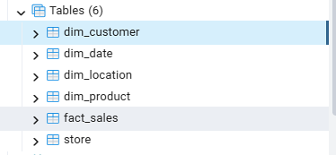

---

## Data Model

The project follows a Star Schema design.

### Model Overview

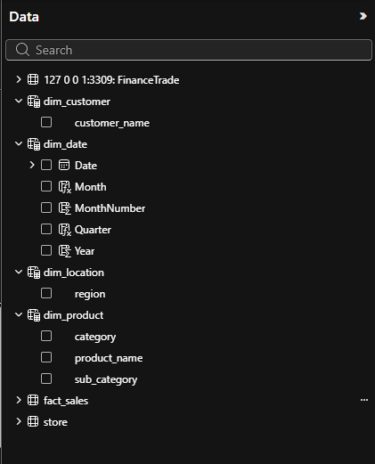

### Customer Dimension

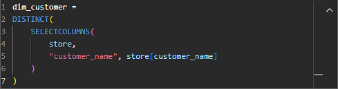

### Product Dimension

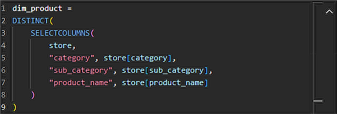

### Location Dimension

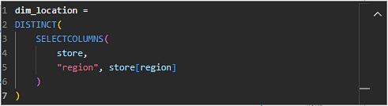

### Date Dimension

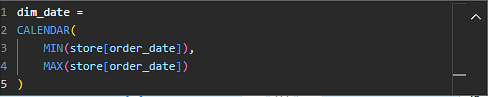

---

## Dashboard Pages

### Executive Overview

Provides high-level business KPIs and performance trends.

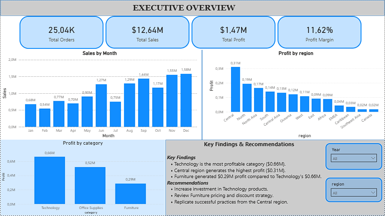

---

### Category & Product Analysis

Analyzes product categories, sub-categories, and top-performing products.

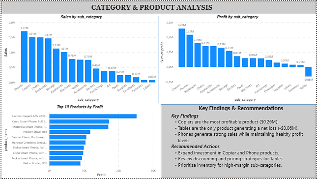

**Key Findings**

- Technology is the most profitable category.
- Copiers generate the highest profit.
- Tables generate negative profit.

---

### Customer Segment Analysis

Analyzes customer performance by segment.

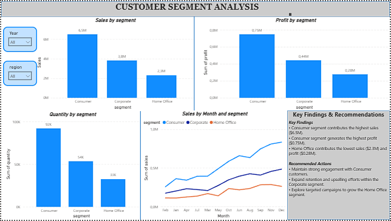

**Key Findings**

- Consumer customers generate the highest sales.
- Home Office customers contribute the lowest revenue.

---

### Regional Analysis

Analyzes sales and profit performance across regions.

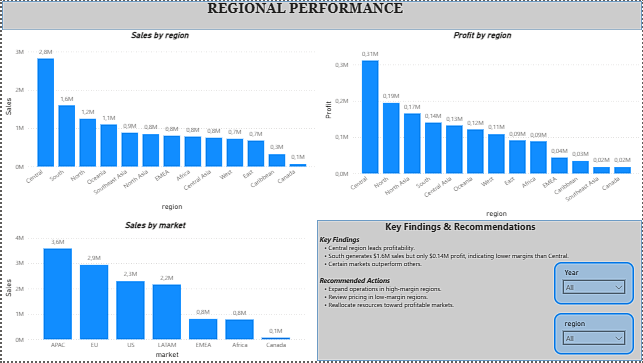

**Key Findings**

- Central region generates the highest profit.
- Several regions generate strong sales but lower profitability.

---

### Discount & Profitability Analysis

Evaluates the relationship between discounting and profitability.

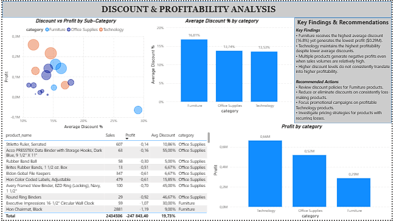

**Key Findings**

- Higher discounts do not always increase profitability.
- Several products generate losses despite strong sales.

---

## Key Insights

- Technology is the most profitable category.
- Consumer customers drive the largest share of revenue.
- Central region generates the highest profit.
- Furniture receives the highest average discount.
- Discounting does not consistently improve profitability.

---

## Repository Structure

```text
global-superstore-powerbi/
│
├── dataset/
│   └── superstore.csv
│
├── docs/
│   ├── Data.png
│   ├── dim_customer.png
│   ├── dim_product.png
│   ├── dim_location.png
│   └── dim_date.png
│
├── screenshots/
│   ├── executive_overview.png
│   ├── category_product_analysis.png
│   ├── customer_segment_analysis.png
│   ├── regional_analysis.png
│   └── discount_profitability_analysis.png
│
├── SQL/
│   └── db_setup.sql
│
└── superstore.pbix
```

---

## Skills Demonstrated

- SQL Querying
- PostgreSQL
- Star Schema Design
- Power BI
- DAX Measures
- KPI Reporting
- Dashboard Development
- Business Intelligence
- Data Analytics

---

## Author

Joseph M. Tsie
